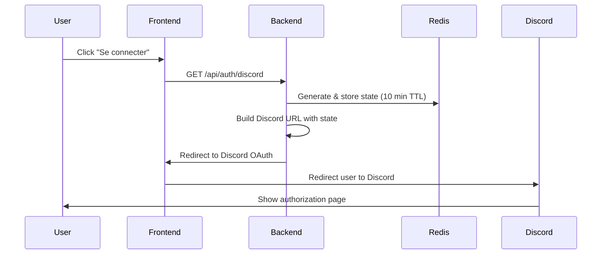
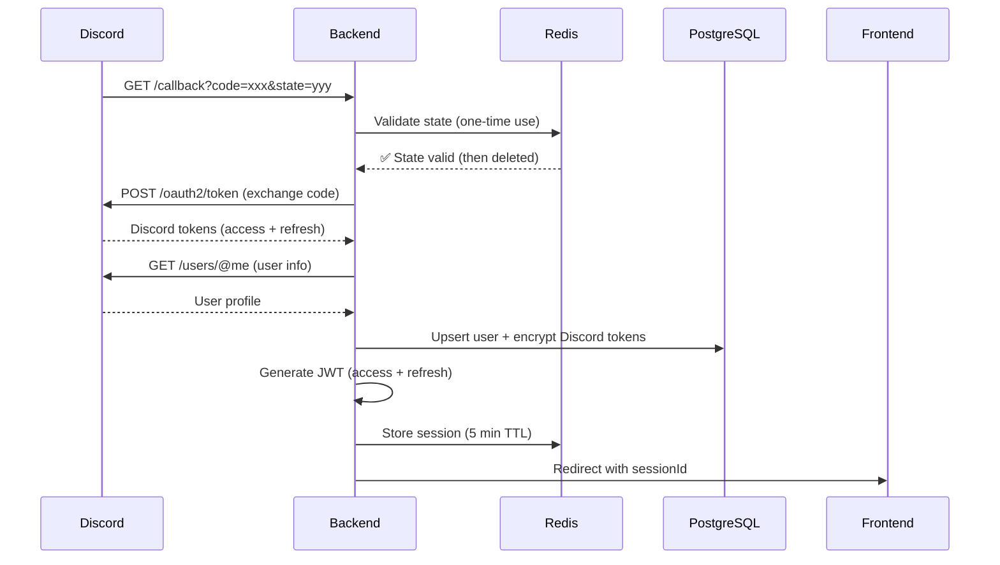
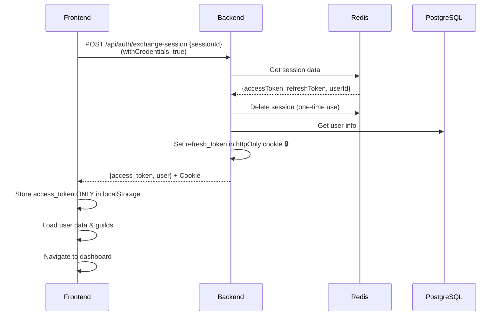
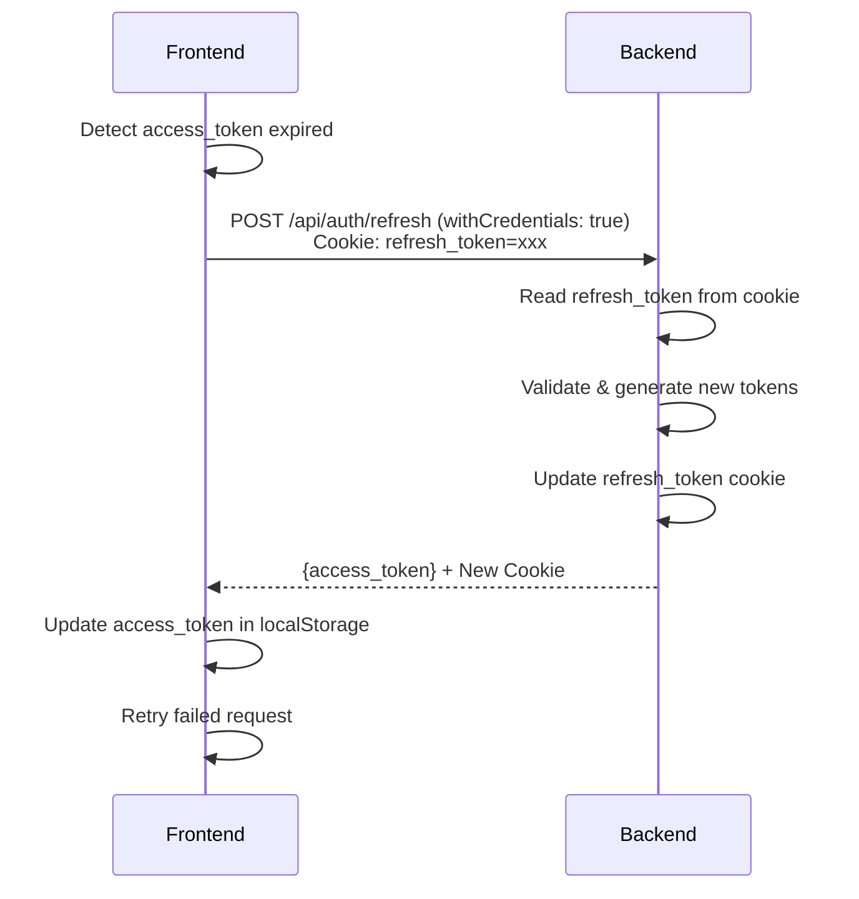

# 📚 Documentation du Module d'Authentification

## 🎯 Vue d'ensemble

Le module d'authentification gère l'ensemble du cycle de vie de l'authentification des utilisateurs via Discord OAuth 2.0, avec des mécanismes de sécurité avancés incluant les **refresh tokens en cookies httpOnly** pour protéger contre les attaques CSRF, XSS, et garantir une expérience utilisateur fluide.

**Version:** 2.0.0  
**Dernière mise à jour:** Octobre 2025  
**Changements majeurs:** Implémentation cookies httpOnly pour refresh tokens (#3)

---

## 🏗️ Architecture Globale

```
┌─────────────────────────────────────────────────────────────────┐
│                         FRONTEND (Angular)                       │
├─────────────────────────────────────────────────────────────────┤
│  AuthFacade → AuthApi (withCredentials) → HTTP Interceptor      │
│  TokenService (localStorage access_token ONLY)                  │
│  AuthData (signals + isInitialized)                             │
│  AuthGuard (async, wait for init)                               │
└────────────────────┬────────────────────────────────────────────┘
                     │ HTTPS + Cookies
┌────────────────────▼────────────────────────────────────────────┐
│                         BACKEND (NestJS)                         │
├─────────────────────────────────────────────────────────────────┤
│  AuthController (cookie-parser middleware)                      │
│    ├─→ AuthService (JWT generation)                            │
│    ├─→ DiscordOAuthService (Discord API)                       │
│    ├─→ OAuthStateService (CSRF protection)                     │
│    ├─→ OAuthSessionService (Temporary sessions)                │
│    └─→ DiscordTokenService (Token cache & refresh)             │
├─────────────────────────────────────────────────────────────────┤
│  Security Layer                                                  │
│    ├─→ JwtAuthGuard (Route protection)                         │
│    ├─→ EncryptionService (Token encryption)                    │
│    ├─→ Cookie httpOnly (Refresh token storage) 🔒 NOUVEAU      │
│    └─→ RedisModule (State & session storage)                   │
└────────────────────┬────────────────────────────────────────────┘
                     │
┌────────────────────▼────────────────────────────────────────────┐
│                    EXTERNAL SERVICES                             │
├─────────────────────────────────────────────────────────────────┤
│  • Discord OAuth API (oauth2/authorize, oauth2/token)          │
│  • PostgreSQL (User data, Refresh tokens hashed)               │
│  • Redis (OAuth states, Temporary sessions)                    │
└─────────────────────────────────────────────────────────────────┘
```

---

## 🔐 Flow d'Authentification Complet

### 1️⃣ **Initiation de la connexion**



### 2️⃣ **Callback Discord**



### 3️⃣ **Échange de session (Frontend) 🔒 MODIFIÉ**



**🔒 Changements sécurité:**
- ✅ Refresh token dans cookie httpOnly (pas en localStorage)
- ✅ Réponse ne contient QUE access_token
- ✅ withCredentials: true pour envoyer/recevoir cookies

### 4️⃣ **Refresh automatique 🔒 NOUVEAU**



**🔒 Sécurité:**
- ✅ Refresh token envoyé automatiquement via cookie
- ✅ Pas besoin de le lire en JavaScript
- ✅ Protection XSS complète

---

## 📦 Services Détaillés

### 🔹 **AuthController** (`auth.controller.ts`) 🔒 MODIFIÉ

**Responsabilité:** Gestion des endpoints d'authentification + cookies httpOnly

**Nouvelles méthodes:**

```typescript
// 🔒 Configuration des cookies httpOnly
private getCookieOptions(): express.CookieOptions {
  return {
    httpOnly: true,                    // Inaccessible en JS
    secure: NODE_ENV === 'production', // HTTPS only en prod
    sameSite: 'lax',                   // Protection CSRF
    maxAge: 7 * 24 * 60 * 60 * 1000,  // 7 jours
    path: '/api/auth',                 // Scope limité
  };
}
```

**Endpoints modifiés:**

```typescript
// POST /api/auth/exchange-session
// 🔒 Set refresh token dans cookie httpOnly
async exchangeSession(@Body() body, @Res() res: express.Response) {
  const session = await this.oauthSessionService.exchangeSession(body.sessionId);
  const user = await this.authService.getCurrentUser(session.userId);

  // Set cookie httpOnly
  res.cookie('refresh_token', session.refreshToken, this.getCookieOptions());

  return res.json({
    access_token: session.accessToken,
    user,
  });
}

// POST /api/auth/refresh
// 🔒 Read refresh token from cookie, update cookie
async refresh(@Req() req: express.Request, @Res() res: express.Response) {
  const refreshToken = req.cookies['refresh_token'];
  
  if (!refreshToken) {
    throw new UnauthorizedException('No refresh token');
  }

  const tokens = await this.authService.refreshTokens(refreshToken);

  // Update cookie with new refresh token
  res.cookie('refresh_token', tokens.refresh_token, this.getCookieOptions());

  return res.json({
    access_token: tokens.access_token,
  });
}

// POST /api/auth/logout
// 🔒 Clear cookie
async logout(@CurrentUser('id') userId, @Req() req, @Res() res) {
  const refreshToken = req.cookies['refresh_token'];
  await this.authService.logout(userId, refreshToken);

  res.clearCookie('refresh_token', { path: '/api/auth' });
  return res.status(204).send();
}
```

---

### 🔹 **AuthService** (`auth.service.ts`) 🔒 MODIFIÉ

**Type interne ajouté:**

```typescript
// Interface interne pour le refresh
// Le service retourne les deux tokens en interne
// Mais le DTO public n'expose que l'access_token
interface InternalTokenRefreshResult {
  access_token: string;
  refresh_token: string;
}

async refreshTokens(refreshToken: string): Promise<InternalTokenRefreshResult> {
  // ... validation & génération ...
  
  return {
    access_token: newTokens.accessToken,
    refresh_token: newTokens.refreshToken,
  };
}
```

---

### 🔹 **Frontend - TokenService** 🔒 MODIFIÉ

**Changements:**

```typescript
// Interface sans refreshToken
interface AuthTokens {
  accessToken: string;
  // refreshToken SUPPRIMÉ
}

// Méthodes supprimées:
// - getRefreshToken() ❌
// - REFRESH_TOKEN_KEY ❌

// Ne gère QUE l'access token
setTokens(tokens: AuthTokens): void {
  localStorage.setItem('access_token', tokens.accessToken);
  // Plus de refresh token à stocker
}
```

---

### 🔹 **Frontend - AuthApiService** 🔒 MODIFIÉ

**Changements:**

```typescript
// Tous les appels avec withCredentials: true
refreshToken(): Observable<RefreshTokenResponseDTO> {
  return this.http.post<RefreshTokenResponseDTO>(
    `${this.baseUrl}/refresh`,
    {}, // Body vide, cookie envoyé automatiquement
    { withCredentials: true } // ✅ CRITIQUE
  );
}

logout(): Observable<void> {
  return this.http.post<void>(
    `${this.baseUrl}/logout`,
    {},
    { withCredentials: true }
  );
}
```

---

### 🔹 **Frontend - AuthFacadeService** 🔒 MODIFIÉ

**Méthode `initializeAuth()` améliorée:**

```typescript
private async initializeAuth(): Promise<void> {
  const tokens = this.tokenService.getTokens();

  if (!tokens) {
    this.authData.setInitialized(true);
    return;
  }

  if (this.tokenService.isTokenExpired(tokens.accessToken)) {
    const refreshed = await this.refreshToken();
    
    if (!refreshed) {
      this.authData.setInitialized(true);
      return;
    }
    
    // ⏱️ Délai pour synchronisation
    await new Promise(resolve => setTimeout(resolve, 100));
  }

  // Récupérer tokens après refresh
  const currentTokens = this.tokenService.getTokens();
  if (currentTokens) {
    this.authData.setTokens(currentTokens);
  }

  try {
    await this.userFacade.initializeUserService();
    await this.guildFacade.initializeGuildService();
  } catch (error) {
    this.handleLogout();
  } finally {
    this.authData.setInitialized(true); // ✅ Toujours appelé
  }
}
```

---

### 🔹 **Frontend - AuthDataService** 🔒 NOUVEAU

**Signal isInitialized ajouté:**

```typescript
private readonly _isInitialized = signal<boolean>(false);
readonly isInitialized = this._isInitialized.asReadonly();

setInitialized(initialized: boolean): void {
  this._isInitialized.set(initialized);
}
```

---

### 🔹 **Frontend - AuthGuard** 🔒 MODIFIÉ

**Guard asynchrone avec attente d'initialisation:**

```typescript
export const authGuard: CanActivateFn = async (route, state) => {
  const authFacade = inject(AuthFacadeService);
  const router = inject(Router);

  // ⏳ Attendre que l'initialisation soit terminée
  if (!authFacade.isInitialized()) {
    await new Promise<void>(resolve => {
      const effectRef = effect(() => {
        if (authFacade.isInitialized()) {
          effectRef.destroy();
          resolve();
        }
      });
    });
  }

  // Puis vérifier auth
  if (authFacade.isAuthenticated()) {
    return true;
  }

  sessionStorage.setItem('returnUrl', state.url);
  return router.parseUrl('/auth/login');
};
```

---

## 🛡️ Sécurité Implémentée

### ✅ **Protection XSS via cookies httpOnly** 🔒 NOUVEAU

**Problème:** Refresh tokens en localStorage accessibles par JavaScript malveillant.

**Solution:**
```typescript
// Backend: Set cookie httpOnly
res.cookie('refresh_token', token, {
  httpOnly: true,  // ✅ Inaccessible en JS
  secure: true,    // ✅ HTTPS only (prod)
  sameSite: 'lax', // ✅ Protection CSRF
  maxAge: 7 * 24 * 60 * 60 * 1000,
  path: '/api/auth',
});

// Frontend: Cookie géré automatiquement
// Pas de code à écrire, tout est automatique
```

**Avantages:**
- ✅ Protection complète contre XSS
- ✅ Pas de vol de refresh token possible
- ✅ Gestion automatique par le navigateur
- ✅ Expiration automatique

### ✅ **Protection CSRF (Cross-Site Request Forgery)**

**Solution state tokens** (inchangée):
```typescript
// Génération du state
const state = await oauthStateService.generateState()

// Validation stricte
await oauthStateService.validateState(state)
// ✅ Existe, ✅ Non utilisé, ✅ Non expiré
```

### ✅ **Protection contre les fuites de tokens**

**Solution sessions temporaires** (inchangée):
```typescript
const sessionId = await createSession(tokens)
redirect(`/callback?session=${sessionId}`)
// ✅ Jamais de tokens dans l'URL
```

### ✅ **Tokens Discord chiffrés**

**Solution AES-256-GCM** (inchangée):
```typescript
const encrypted = encryptionService.encrypt(discordToken)
// ✅ Protection si DB compromise
```

---

## 🗄️ Modèle de Données

### **Cookies (Browser)**

```typescript
// Cookie httpOnly (géré par le navigateur)
Name: refresh_token
Value: eyJhbGciOiJIUzI1NiIs... (JWT)
Domain: localhost (ou votre domaine)
Path: /api/auth
HttpOnly: true ✅
Secure: true (prod) ✅
SameSite: Lax ✅
Max-Age: 604800 (7 jours)
```

### **localStorage (Browser)**

```typescript
// UNIQUEMENT l'access token
{
  "access_token": "eyJhbGciOiJIUzI1NiIs..."
  // refresh_token ABSENT ✅
}
```

---

## 🔧 Configuration

### **Backend - main.ts**

```typescript
import * as cookieParser from 'cookie-parser';

app.use(cookieParser()); // ✅ Middleware

app.enableCors({
  origin: process.env.FRONTEND_URL,
  credentials: true, // ✅ Permettre cookies
  methods: ['GET', 'POST', 'PUT', 'DELETE', 'PATCH'],
  allowedHeaders: ['Content-Type', 'Authorization'],
});
```

### **Frontend - Tous les appels API**

```typescript
// withCredentials: true sur TOUS les appels auth
{ withCredentials: true }
```

### **Variables d'environnement**

```bash
# Backend
NODE_ENV=development # ou production
FRONTEND_URL=http://localhost:4200
JWT_SECRET=xxx
JWT_REFRESH_SECRET=xxx
ENCRYPTION_KEY=xxx

# En production
NODE_ENV=production
FRONTEND_URL=https://app.example.com
```

---

## 🧪 Tests & Debugging

### **Test 1: Cookie httpOnly**

```javascript
// Console navigateur
document.cookie
// ✅ refresh_token NE DOIT PAS apparaître

// DevTools → Application → Cookies
// ✅ refresh_token doit avoir HttpOnly: ☑️
```

### **Test 2: localStorage propre**

```javascript
localStorage.getItem('access_token')  // ✅ Existe
localStorage.getItem('refresh_token') // ✅ null
```

### **Test 3: Refresh automatique**

1. Forcer expiration: `localStorage.setItem('access_token', 'expired')`
2. Recharger la page
3. ✅ Doit rester connecté (refresh auto)

### **Test 4: Network inspection**

```
POST /api/auth/refresh
Request Headers:
  Cookie: refresh_token=xxx ✅

Response Headers:
  Set-Cookie: refresh_token=yyy; HttpOnly; ... ✅

Response Body:
  { "access_token": "zzz" } ✅
  (PAS de refresh_token)
```

---

## 📞 Support & Troubleshooting

### **Erreurs courantes**

**1. "No refresh token provided"**
```
Cause: Cookie non envoyé
Solution: Vérifier withCredentials: true + CORS credentials: true
```

**2. "CORS error credentials mode"**
```
Cause: Configuration CORS incorrecte
Solution: Backend credentials: true + Frontend withCredentials: true
```

**3. Cookie non créé**
```
Cause: cookie-parser non configuré
Solution: Vérifier app.use(cookieParser()) dans main.ts
```

**4. Cookie créé mais non envoyé**
```
Cause: Domain mismatch ou path incorrect
Solution: Vérifier path: '/api/auth' et domaine
```

---

## 📚 Ressources

### **Documentation externe**

- [OWASP: httpOnly Cookies](https://owasp.org/www-community/HttpOnly)
- [MDN: HTTP Cookies](https://developer.mozilla.org/en-US/docs/Web/HTTP/Cookies)
- [NestJS: Cookies](https://docs.nestjs.com/techniques/cookies)
- [Angular: HttpClient withCredentials](https://angular.io/api/common/http/HttpClient)

---

## 🎉 Changelog

### Version 2.0.0 (Octobre 2025)
- ✅ **#3 RÉSOLU:** Refresh tokens en cookies httpOnly
- ✅ Protection XSS complète
- ✅ Guard asynchrone avec attente initialisation
- ✅ Signal isInitialized pour synchronisation
- ✅ CORS avec credentials activé

### Version 1.0.0 (Septembre 2025)
- ✅ OAuth Discord avec state CSRF
- ✅ Sessions temporaires Redis
- ✅ Tokens Discord chiffrés
- ✅ Refresh automatique tokens Discord

---

**Version:** 2.0.0  
**Dernière mise à jour:** Octobre 2025  
**Maintenu par:** L'équipe Backend

🔒 **Sécurité avant tout!**
